# 猫咪点击游戏 - 软件著作权设计说明文档

## 1. 软件总体设计

### 1.1 设计目标

实现一个基于 Canvas 的休闲点击游戏，支持抖音小游戏平台，具有以下特点：
- 原生 JavaScript (ES6+) 开发，无需第三方框架
- 流畅的 60fps 动画效果
- 多种运动模式和交互机制
- 完整的广告解锁和收益系统
- 优秀的视觉表现（多层草地渲染、粒子特效）

### 1.2 技术架构

**技术栈**：原生 JavaScript (ES6+) + Canvas 2D + 抖音小游戏 API (tt.*)

**架构模式**：分层管理器模式 + 中央协调器 + 组件化结构

```
用户输入 → InputManager → Game (中央协调器)
                              ├─ GameStateManager (状态管理)
                              ├─ SpawnManager (实体生成)
                              ├─ ResourceManager (资源加载)
                              ├─ AudioManager (音频管理)
                              ├─ AdManager (广告管理)
                              ├─ SettingsManager (设置持久化)
                              ├─ Renderers (背景/HUD/特效)
                              └─ Screens (开始/选择/结算)
```

### 1.3 系统总体架构图

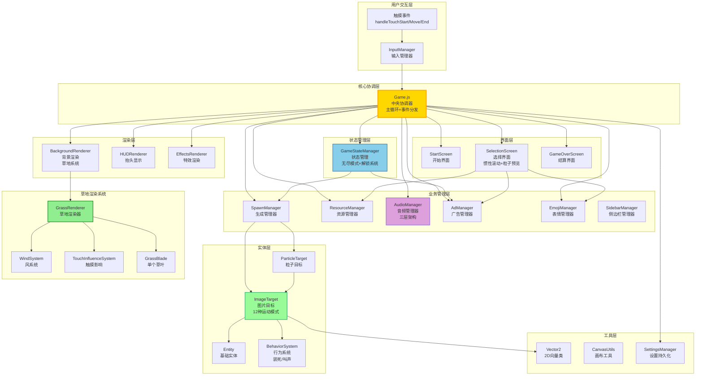

---

## 2. 软件结构图

### 2.1 目录结构

```
src/
├── Game.js                 # 中央协调器 (819行)
├── config.js               # 全局配置 (690行)
├── InputManager.js         # 输入管理
├── AudioManager.js         # 音频管理 (单例)
├── SettingsManager.js      # 设置持久化 (单例)
├── entities/
│   ├── Entity.js           # 基础实体
│   ├── ImageTarget.js      # 目标实体 (925行, 12种运动模式)
│   └── ParticleTarget.js   # 粒子目标
├── managers/
│   ├── GameStateManager.js # 状态管理
│   ├── SpawnManager.js     # 生成管理
│   ├── ResourceManager.js  # 资源管理
│   ├── AdManager.js        # 广告管理
│   ├── EmojiManager.js     # 表情管理
│   └── SidebarManager.js   # 侧边栏奖励
├── renderers/
│   ├── BackgroundRenderer.js
│   ├── HUDRenderer.js
│   ├── EffectsRenderer.js
│   └── grass/
│       ├── GrassRenderer.js
│       ├── WindSystem.js
│       ├── TouchInfluenceSystem.js
│       ├── GrassBlade.js
│       └── GrassDecoration.js
├── screens/
│   ├── StartScreen.js
│   ├── SelectionScreen.js
│   └── GameOverScreen.js
├── systems/
│   └── BehaviorSystem.js
├── behaviors/
│   ├── PlayDeadBehavior.js
│   └── VocalizationBehavior.js
└── utils/
    ├── Vector2.js
    └── CanvasUtils.js
```

### 2.2 模块依赖关系图

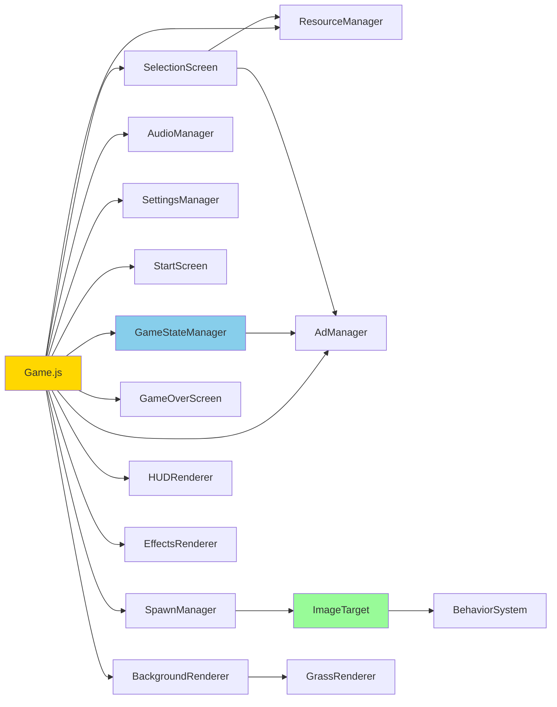

---

## 3. 功能流程图

### 3.1 游戏状态转换流程

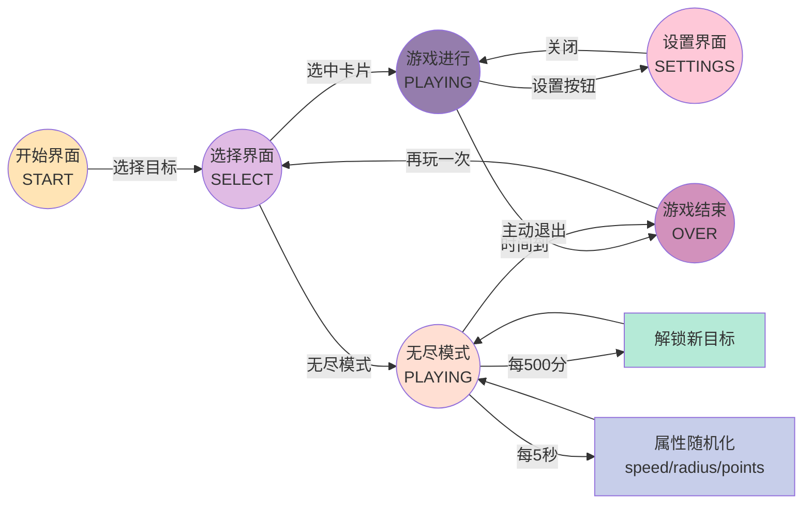

### 3.2 触摸事件处理流程

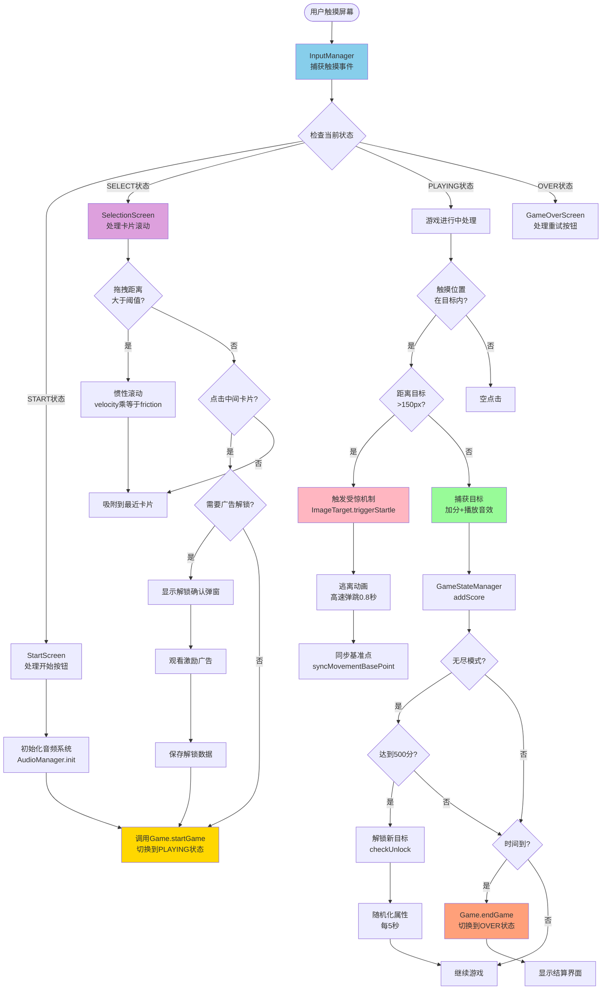

### 3.3 受惊机制执行流程

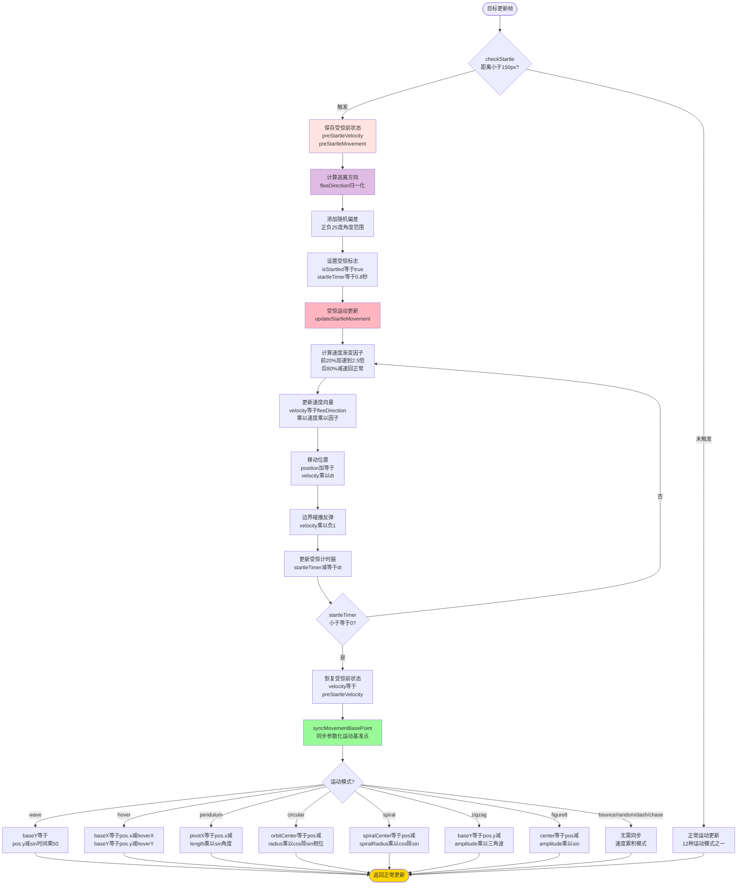

### 3.4 无尽模式流程

```mermaid
graph TB
    Start([选择无尽模式]) --> GetAvailable[getAvailableTargetIndices<br/>获取可用目标列表]

    GetAvailable --> CheckConfig{USE_ALL_TARGETS<br/>配置?}

    CheckConfig -->|true| AllTargets[返回所有目标索引<br/>0到N-1]
    CheckConfig -->|false| CheckUnlock[检查AdManager<br/>isTargetUnlocked]

    CheckUnlock --> UnlockedIndices[返回已解锁目标索引]
    AllTargets --> SelectRandom
    UnlockedIndices --> SelectRandom

    SelectRandom[随机选择初始目标] --> InitState[初始化无尽模式状态<br/>unlockedTargetIndices<br/>nextUnlockScore等于500]

    InitState --> StartGame[startGame<br/>切换到PLAYING状态]

    StartGame --> GameLoop[游戏主循环]

    GameLoop --> UpdateTimer[更新计时器<br/>gameTimer加等于dt]
    UpdateTimer --> CheckAttrChange{计时器大于等于5秒?}

    CheckAttrChange -->|是| RandomizeAttr[randomizeAttributes<br/>随机化乘数]
    CheckAttrChange -->|否| CheckScore

    RandomizeAttr[速度乘数:0.8-1.5<br/>半径乘数:0.7-1.3<br/>分数乘数:0.5-2.0] --> ResetTimer[重置计时器]
    ResetTimer --> CheckScore

    CheckScore{分数大于等于<br/>nextUnlockScore?} -->|是| GetAvailable2[重新获取可用目标]
    CheckScore -->|否| ContinueGame[继续游戏]

    GetAvailable2 --> FindNext[查找下一个<br/>未解锁目标]
    FindNext --> Found{找到?}

    Found -->|是| AddToUnlocked[添加到解锁列表<br/>unlockedTargetIndices.push]
    Found -->|否| AllUnlocked[所有目标已解锁]

    AddToUnlocked --> ShowNotify[显示解锁通知<br/>unlockNotification]
    ShowNotify --> UpdateNextScore[nextUnlockScore加等于500]
    UpdateNextScore --> CheckAdTrigger{应该触发<br/>解锁广告?}

    CheckAdTrigger -->|是| TriggerAd[异步触发广告<br/>50%概率]
    CheckAdTrigger -->|否| ContinueGame
    TriggerAd --> ContinueGame

    AllUnlocked --> ContinueGame
    ContinueGame --> GameLoop

    style Start fill:#FFD700
    style InitState fill:#98FB98
    style RandomizeAttr fill:#DDA0DD
    style AddToUnlocked fill:#87CEEB
    style ContinueGame fill:#90EE90
```

### 3.5 广告解锁流程

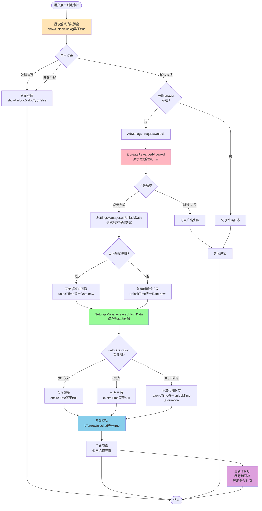

### 3.6 音频分层播放流程

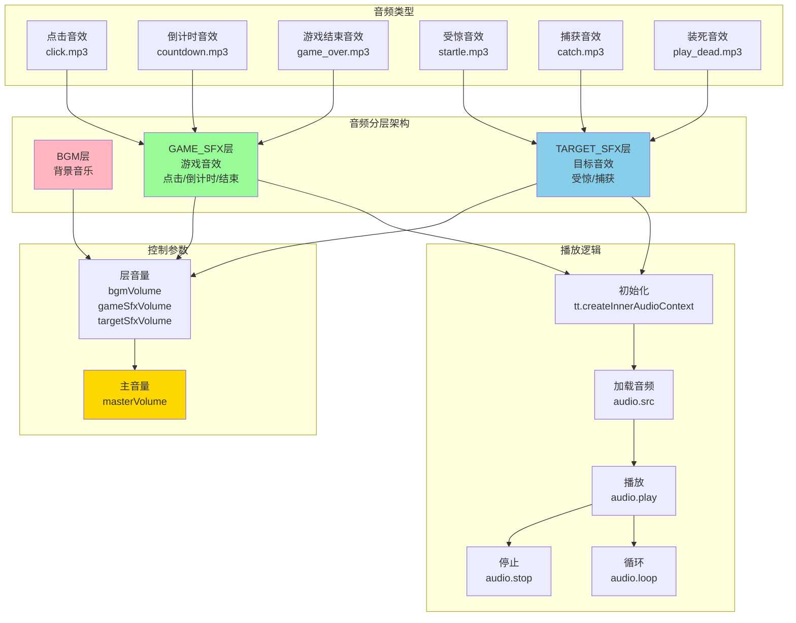

### 3.7 多层草地渲染流程

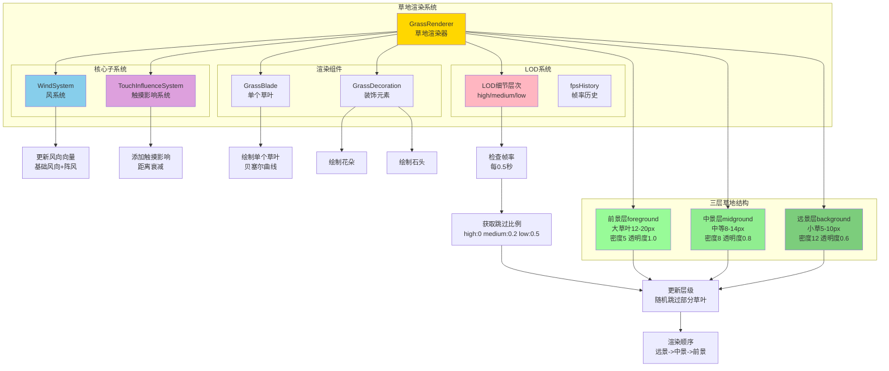

---

## 4. 逻辑框图

### 4.1 运动模式分类

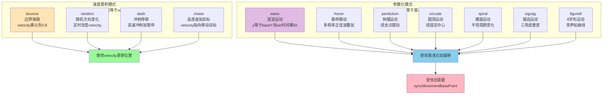

### 4.2 惯性滚动算法流程

```mermaid
graph TB
    Start([用户拖动卡片]) --> HandleMove[handleTouchMove<br/>更新scrollOffset]

    HandleMove --> CalcVelocity[计算滚动速度<br/>velocity等于lastX减x<br/>除以dt乘16]

    CalcVelocity --> LimitVelocity[限制最大速度<br/>maxVelocity等于25]

    LimitVelocity --> UpdateOffset[scrollOffset加等于velocity]

    UpdateOffset --> CheckBoundary{超出边界?}

    CheckBoundary -->|是| AddFriction[增加阻尼<br/>friction等于0.7]
    CheckBoundary -->|否| NormalFriction[正常阻尼<br/>friction等于0.95]

    AddFriction --> ApplyFriction[velocity乘等于friction]
    NormalFriction --> ApplyFriction

    ApplyFriction --> CheckVelocity{velocity绝对值小于1?}

    CheckVelocity -->|否| ContinueInertia[继续惯性滚动]
    CheckVelocity -->|是| StartSnapping[开始吸附]

    ContinueInertia --> HardLimit{硬边界限制}
    HardLimit -->|超出| SetVelocityZero[velocity等于0<br/>限制offset]
    HardLimit -->|未超出| UpdateOffset

    StartSnapping --> CalcTargetIndex[计算目标索引<br/>targetIndex等于round<br/>offset除以cardStep]

    CalcTargetIndex --> ClampIndex[限制索引范围<br/>0到length减1]

    ClampIndex --> CalcTargetOffset[计算目标偏移<br/>targetOffset等于<br/>index乘以cardStep]

    CalcTargetOffset --> SmoothSnap[平滑吸附<br/>offset加等于<br/>target减offset乘0.15]

    SmoothSnap --> CheckClose{距离小于0.5?}

    CheckClose -->|否| SmoothSnap
    CheckClose -->|是| SetOffset[设置最终偏移<br/>offset等于targetOffset]

    SetOffset --> CheckBoundary2{超出边界?}

    CheckBoundary2 -->|是| ElasticReturn[弹性回弹<br/>offset加等于<br/>0减offset乘0.2]
    CheckBoundary2 -->|否| AutoScrollCheck{自动轮播?}

    ElasticReturn --> AutoScrollCheck

    AutoScrollCheck -->|计时器到| NextCard[移动到下一张卡片<br/>currentIndex加加]
    AutoScrollCheck -->|未到| End([结束])

    NextCard --> HandleLast{最后一张?}
    HandleLast -->|是| WrapToFirst[循环到第一张<br/>velocity等于负offset除10]
    HandleLast -->|否| SetSnapping[isSnapping等于true]

    WrapToFirst --> SetSnapping
    SetSnapping --> End

    style HandleMove fill:#FFE4B5
    style ApplyFriction fill:#E0BBE4
    style SmoothSnap fill:#98FB98
    style AutoScrollCheck fill:#87CEEB
```

### 4.3 类关系图

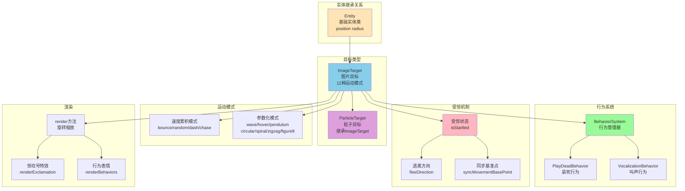

---

## 5. 接口设计

### 5.1 模块间接口定义

#### Game.js 公共 API

```javascript
class Game {
    // 初始化游戏
    constructor(canvas)

    // 游戏流程控制
    start()                    // 启动游戏主循环
    startGame(targetConfig)    // 开始游戏
    startEndlessMode()         // 启动无尽模式
    endGame()                  // 结束游戏

    // 触摸事件处理
    handleTouchStart(pos)      // 触摸开始
    handleTouchMove(pos)       // 触摸移动
    handleTouchEnd(pos)        // 触摸结束

    // 渲染
    render()                   // 渲染游戏画面
}
```

#### GameStateManager 接口

```javascript
class GameStateManager {
    // 状态管理
    setState(newState)         // 设置状态
    getState()                 // 获取当前状态
    enterSettings()            // 进入设置
    exitSettings()             // 退出设置

    // 游戏流程
    startGame(target, isEndless) // 开始游戏
    startEndlessMode()         // 启动无尽模式
    endGame()                  // 结束游戏

    // 分数系统
    addScore(points)           // 增加分数
    getCurrentTargetId()       // 获取当前目标ID

    // 无尽模式
    checkUnlock()              // 检查解锁新目标
    randomizeAttributes()      // 随机化属性
    getAvailableTargetIndices() // 获取可用目标索引

    // 游戏逻辑
    update(dt)                 // 更新游戏逻辑
}
```

#### ImageTarget 接口

```javascript
class ImageTarget extends Entity {
    // 运动更新
    update(dt, canvasWidth, canvasHeight)

    // 受惊机制
    checkStartle(touchPosition)    // 检查受惊
    triggerStartle(touchPosition)  // 触发受惊
    syncMovementBasePoint()        // 同步基准点

    // 渲染
    render(ctx)                    // 渲染目标

    // 运动模式（内部方法）
    updateBounce(dt, w, h)
    updateWave(dt, w, h)
    updateRandom(dt, w, h)
    updateCircular(dt, w, h)
    updateSpiral(dt, w, h)
    updateZigzag(dt, w, h)
    updateFigure8(dt, w, h)
    updateDash(dt, w, h)
    updateHover(dt, w, h)
    updatePendulum(dt, w, h)
    updateChase(dt, w, h)
}
```

### 5.2 事件回调接口

```javascript
// InputManager 回调函数类型
type TouchCallback = (position: Vector2) => void

interface InputManager {
    onTouchStart: TouchCallback
    onTouchMove: TouchCallback
    onTouchEnd: TouchCallback
}

// AdManager 回调函数类型
type AdResultCallback = (success: boolean) => void

interface AdManager {
    requestUnlock(targetId: string): Promise<boolean>
    isTargetUnlocked(targetId: string): boolean
}
```

### 5.3 抖音 API 集成接口

```javascript
// 图片加载
tt.createImage(): HTMLImageElement

// 音频上下文
tt.createInnerAudioContext(): InnerAudioContext

// 广告API
tt.createRewardedVideoAd(options): RewardedVideoAd

// 本地存储
tt.setStorageSync(key: string, data: any): void
tt.getStorageSync(key: string): any

// 系统信息
tt.getSystemInfoSync(): SystemInfo
```

---

## 6. 模块名称功能

### 6.1 核心模块

| 模块名称 | 文件路径 | 行数 | 功能描述 |
|---------|---------|------|---------|
| Game | src/Game.js | 819 | 中央协调器，管理游戏主循环、状态转换、事件分发 |
| config | src/config.js | 690 | 全局配置，包括目标类型、运动参数、UI配置 |

### 6.2 管理器模块

| 模块名称 | 文件路径 | 行数 | 功能描述 |
|---------|---------|------|---------|
| GameStateManager | src/managers/GameStateManager.js | 370 | 状态机管理、无尽模式逻辑、解锁系统 |
| SpawnManager | src/managers/SpawnManager.js | - | 目标生成工厂，控制生成频率和数量 |
| ResourceManager | src/managers/ResourceManager.js | - | 资源预加载和缓存管理 |
| AudioManager | src/managers/AudioManager.js | 250 | 三层音频架构（BGM/GAME_SFX/TARGET_SFX） |
| AdManager | src/managers/AdManager.js | 400 | 广告触发、解锁数据管理、时效检查 |
| EmojiManager | src/managers/EmojiManager.js | - | Emoji精灵图渲染管理 |
| SidebarManager | src/managers/SidebarManager.js | - | 侧边栏入口和奖励动画 |

### 6.3 渲染模块

| 模块名称 | 文件路径 | 功能描述 |
|---------|---------|---------|
| BackgroundRenderer | src/renderers/BackgroundRenderer.js | 背景渲染，集成草地系统 |
| HUDRenderer | src/renderers/HUDRenderer.js | 抬头显示（分数、倒计时） |
| EffectsRenderer | src/renderers/EffectsRenderer.js | 特效渲染（粒子、爆炸） |
| GrassRenderer | src/renderers/grass/GrassRenderer.js | 多层草地渲染系统（420行） |
| WindSystem | src/renderers/grass/WindSystem.js | 风力计算和阵风模拟 |
| TouchInfluenceSystem | src/renderers/grass/TouchInfluenceSystem.js | 触摸交互影响系统 |
| GrassBlade | src/renderers/grass/GrassBlade.js | 单个草叶对象，贝塞尔曲线渲染 |
| GrassDecoration | src/renderers/grass/GrassDecoration.js | 草地装饰元素（花、石头） |

### 6.4 实体模块

| 模块名称 | 文件路径 | 行数 | 功能描述 |
|---------|---------|------|---------|
| Entity | src/entities/Entity.js | - | 基础实体类 |
| ImageTarget | src/entities/ImageTarget.js | 987 | 图片目标，12种运动模式+受惊机制 |
| ParticleTarget | src/entities/ParticleTarget.js | - | 粒子目标，继承ImageTarget |

### 6.5 界面模块

| 模块名称 | 文件路径 | 行数 | 功能描述 |
|---------|---------|------|---------|
| StartScreen | src/screens/StartScreen.js | - | 开始界面 |
| SelectionScreen | src/screens/SelectionScreen.js | 1023 | 卡片选择，惯性滚动+粒子预览+解锁弹窗 |
| GameOverScreen | src/screens/GameOverScreen.js | - | 结算界面 |

---

## 7. 函数名称功能

### 7.1 Game.js 核心函数

| 函数名 | 功能描述 |
|--------|---------|
| `constructor(canvas)` | 初始化所有管理器和组件 |
| `start()` | 启动游戏主循环（requestAnimationFrame） |
| `update(dt)` | 每帧更新逻辑（状态管理器→目标→屏幕） |
| `render()` | 每帧渲染（背景→目标→HUD→屏幕→特效） |
| `handleTouchStart(pos)` | 处理触摸开始，分发到当前屏幕 |
| `handleTouchMove(pos)` | 处理触摸移动 |
| `handleTouchEnd(pos)` | 处理触摸结束 |
| `startGame(targetConfig)` | 开始游戏，初始化状态和目标 |
| `startEndlessMode()` | 启动无尽模式 |
| `endGame()` | 结束游戏，保存最高分 |

### 7.2 ImageTarget 运动函数

| 函数名 | 功能描述 |
|--------|---------|
| `update(dt, w, h)` | 主更新循环，选择运动模式 |
| `render(ctx)` | Canvas渲染，旋转+缩放+受惊特效 |
| `checkStartle(pos)` | 受惊检测，距离<150px触发 |
| `triggerStartle(pos)` | 触发受惊，计算逃离方向 |
| `syncMovementBasePoint()` | 同步参数化运动基准点 |
| `updateBounce()` | 弹跳运动 |
| `updateWave()` | 波浪运动 |
| `updateRandom()` | 随机方向变化 |
| `updateCircular()` | 圆周运动 |
| `updateSpiral()` | 螺旋运动 |
| `updateZigzag()` | 锯齿运动 |
| `updateFigure8()` | 8字形运动 |
| `updateDash()` | 冲刺停顿 |
| `updateHover()` | 悬停飘动 |
| `updatePendulum()` | 钟摆运动 |
| `updateChase()` | 追逐虚拟目标 |

### 7.3 GameStateManager 状态函数

| 函数名 | 功能描述 |
|--------|---------|
| `setState(newState)` | 设置游戏状态 |
| `getState()` | 获取当前状态 |
| `enterSettings()` | 进入设置界面 |
| `exitSettings()` | 退出设置界面 |
| `startGame(target, isEndless)` | 开始游戏 |
| `startEndlessMode()` | 启动无尽模式 |
| `endGame()` | 结束游戏 |
| `addScore(points)` | 增加分数 |
| `checkUnlock()` | 检查解锁新目标 |
| `randomizeAttributes()` | 随机化无尽模式属性 |
| `getAvailableTargetIndices()` | 获取可用目标索引 |
| `update(dt)` | 更新游戏逻辑 |

### 7.4 SelectionScreen 滚动函数

| 函数名 | 功能描述 |
|--------|---------|
| `handleTouchStart(pos)` | 触摸开始，记录拖动起点 |
| `handleTouchMove(pos)` | 触摸移动，更新偏移+计算速度 |
| `handleTouchEnd(pos)` | 触摸结束，判断点击/滑动 |
| `update(dt)` | 惯性滚动+吸附+自动轮播 |
| `renderCard(index, x, y)` | 渲染单个卡片 |
| `renderParticlePreview()` | 渲染粒子预览效果 |
| `handleCardClick(pos)` | 处理卡片点击 |
| `handleUnlockDialogClick(pos)` | 处理解锁弹窗点击 |
| `requestUnlockTarget()` | 请求解锁目标 |
| `selectTargetById(id)` | 根据ID选中卡片 |

---

## 8. 算法说明

### 8.1 运动算法详解

#### 速度累积模式（4种）

**bounce（弹跳）**：
```
position += velocity * dt
if 超出边界:
    position = 边界位置
    velocity *= -0.8  // 反弹并衰减
```

**random（随机方向）**：
```
if Math.random() < 0.02:
    angle = Math.random() * 2π
    velocity = (cos(angle), sin(angle)) * speed
position += velocity * dt
```

**dash（冲刺）**：
```
if isDashing:
    position += dashVelocity * dt  // 高速冲刺
else:
    position += wobble  // 轻微晃动
if timer > 阈值:
    切换冲刺/停顿状态
```

**chase（追逐）**：
```
targetPos = (centerX + radius*sin(t), centerY + radius*cos(t))
direction = normalize(targetPos - position)
position += direction * chaseSpeed * dt
```

#### 参数化模式（8种）

**wave（波浪）**：
```
position.x += direction * speed * dt
position.y = baseY + sin(time) * 50
```

**hover（悬停）**：
```
baseX += driftDirection * driftSpeed * dt
hoverX = amplitude * sin(time*1.5) + 0.5*amplitude * sin(time*2.7)
hoverY = amplitude * sin(time*1.8) + 0.5*amplitude * sin(time*3.1)
position = (baseX + hoverX, baseY + hoverY)
```

**pendulum（钟摆）**：
```
angle = maxAngle * sin(time * angularFreq)
position.x = pivotX + length * sin(angle)
position.y = pivotY + length * cos(angle)
```

**circular（圆周）**：
```
position.x = orbitCenterX + orbitRadius * cos(time*angularSpeed + phase)
position.y = orbitCenterY + orbitRadius * sin(time*angularSpeed + phase)
```

**spiral（螺旋）**：
```
spiralRadius 在 baseRadius 和 maxRadius 之间周期性变化
position.x = spiralCenterX + spiralRadius * cos(time*angularSpeed + phase)
position.y = spiralCenterY + spiralRadius * sin(time*angularSpeed + phase)
```

**zigzag（锯齿）**：
```
position.x += direction * speed * dt
t = (time * frequency) % 1
triangle = t < 0.5 ? 4*t - 1 : 3 - 4*t
position.y = baseY + amplitude * triangle
```

**figure8（8字形）**：
```
position.x = center.x + amplitudeX * sin(2 * time * angularSpeed)
position.y = center.y + amplitudeY * sin(time * angularSpeed)
```

### 8.2 受惊机制算法

```
触发条件：distance < 150px
执行流程：
1. 保存 preStartleVelocity 和 preStartleMovement
2. 计算 fleeDirection = normalize(touchPos - position)
3. 添加随机偏差 ±25度
4. 速度渐变：
   - 前20%：加速到 2.5倍
   - 后80%：减速回正常
5. 受惊结束时调用 syncMovementBasePoint() 同步基准点
```

**基准点同步公式**（以 hover 为例）：
```
baseX = position.x - hoverX(time)
baseY = position.y - hoverY(time)
其中：
hoverX = amp * sin(time*1.5) + 0.5*amp * sin(time*2.7)
hoverY = amp * sin(time*1.8) + 0.5*amp * sin(time*3.1)
```

### 8.3 无尽模式算法

```
初始化：
1. 根据 USE_ALL_TARGETS 配置确定目标池
2. 随机选择初始目标
3. 设置 nextUnlockScore = 500

游戏循环：
1. 每5秒随机化属性：
   - speedMultiplier: [0.8, 1.5]
   - radiusMultiplier: [0.7, 1.3]
   - pointsMultiplier: [0.5, 2.0]
2. 每500分解锁新目标：
   - 从目标池中选择下一个未解锁目标
   - 添加到 unlockedTargetIndices
   - nextUnlockScore += 500
```

### 8.4 草地渲染算法

**三层LOD系统**：
```
前景层: bladeHeight [12, 20], density 5, opacity 1.0
中景层: bladeHeight [8, 14], density 8, opacity 0.8
远景层: bladeHeight [5, 10], density 12, opacity 0.6
```

**风力算法**：
```
gustPhase = (timer % gustDuration) / gustDuration  // 0-1 循环
gustFactor = sin(gustPhase * π)  // 半正弦波
currentIntensity = 1 + gustFactor * gustIntensity

angleVariance = sin(time*0.001) * 0.15 + sin(time*0.0007) * 0.05
finalAngle = baseAngle + angleVariance
windVector = (cos(finalAngle)*intensity, sin(finalAngle)*intensity)
```

**LOD动态调整**：
```
if lodLevel == 'high': skipRatio = 0
if lodLevel == 'medium': skipRatio = 0.2
if lodLevel == 'low': skipRatio = 0.5

更新/渲染时随机跳过部分草叶
```

---

## 9. 运行设计

### 9.1 运行环境

- **平台**：抖音小游戏平台
- **引擎**：原生 JavaScript (ES6+) + Canvas 2D
- **设备支持**：iOS/Android 移动设备
- **DPR支持**：高DPI设备适配

### 9.2 数据流

```
用户触摸
  ↓
InputManager (捕获+标准化)
  ↓
Game (事件分发)
  ↓
┌─────────┬─────────┬─────────┬─────────┐
↓         ↓         ↓         ↓         ↓
StartScreen  SelectionScreen  Playing  GameOverScreen
              ↓              ↓
          惯性滚动      捕获目标
          粒子预览      触发受惊
          解锁弹窗      更新分数
```

### 9.3 错误处理

| 错误类型 | 处理方式 |
|---------|---------|
| 资源加载失败 | 显示占位符，记录日志 |
| 音频初始化失败 | 延迟到用户交互后初始化 |
| 广告加载失败 | 降级为免费体验，记录日志 |
| 存储空间不足 | 清理过期数据 |

### 9.4 性能优化

1. **OffscreenCanvas 缓存**：静态元素预渲染
2. **LOD系统**：根据帧率动态调整渲染质量
3. **对象池**：复用粒子和特效对象
4. **分层渲染**：远景低密度，前景高密度

---

## 10. 创新点说明

### 10.1 多层草地渲染系统

**技术特点**：
- 三层LOD系统（前景/中景/远景）
- 贝塞尔曲线绘制自然草叶形状
- 风力系统模拟自然风（阵风+方向摆动）
- 触摸交互影响（多点触摸+距离衰减）

### 10.2 音频分层架构

**技术特点**：
- 三层独立控制（BGM/GAME_SFX/TARGET_SFX）
- 支持同时播放多层音效
- 基于优先级的音效混音

### 10.3 受惊交互机制

**技术特点**：
- 智能位置同步防止漂移
- 参数化运动基准点反推算法
- 速度渐变产生自然逃离效果

### 10.4 无尽模式动态平衡

**技术特点**：
- 渐进式解锁系统（每500分）
- 属性随机化（每5秒）
- 可配置目标池（全部/已解锁）

### 10.5 惯性滚动算法

**技术特点**：
- 渐进式阻尼（边界高阻尼）
- 平滑吸附算法
- 弹性边界回弹
- 自动轮播机制
